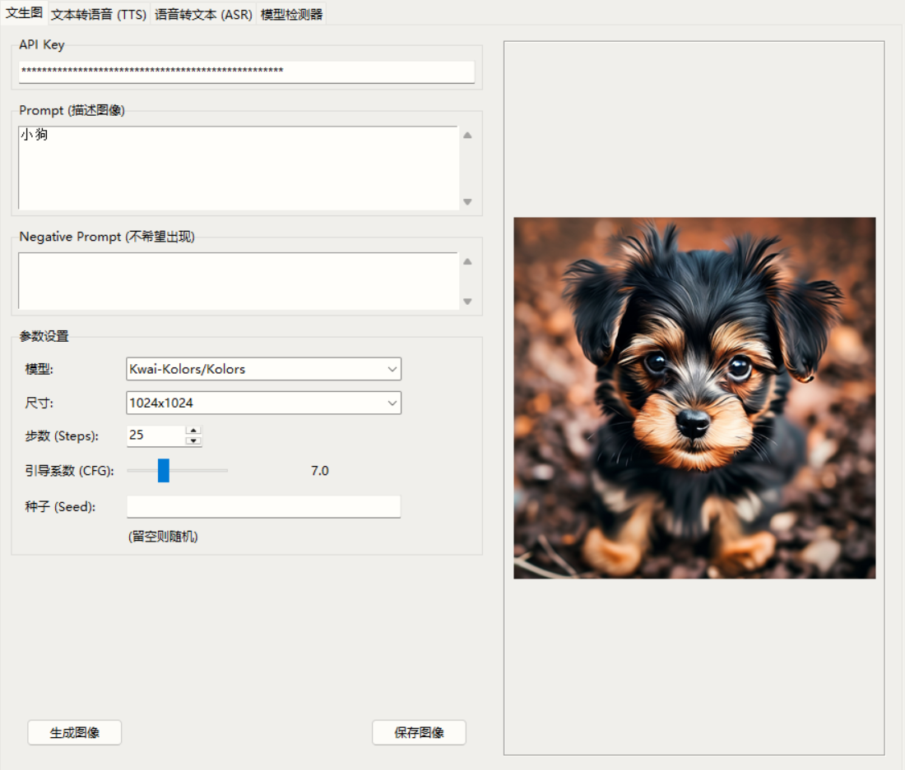
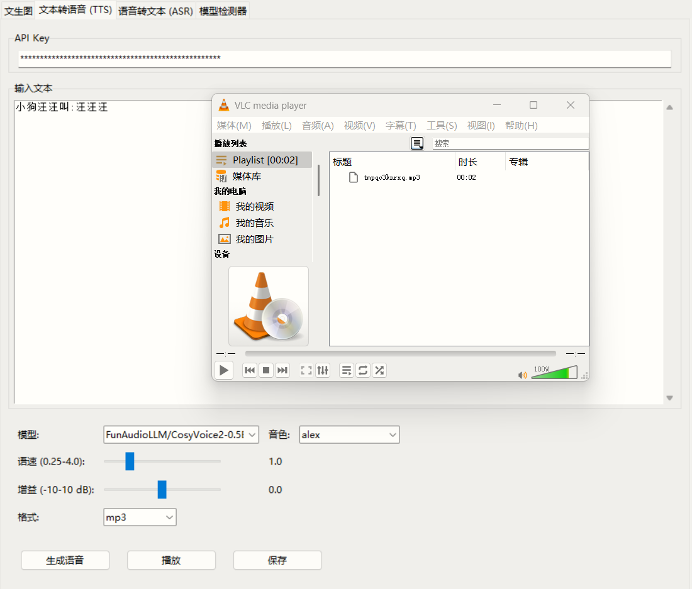
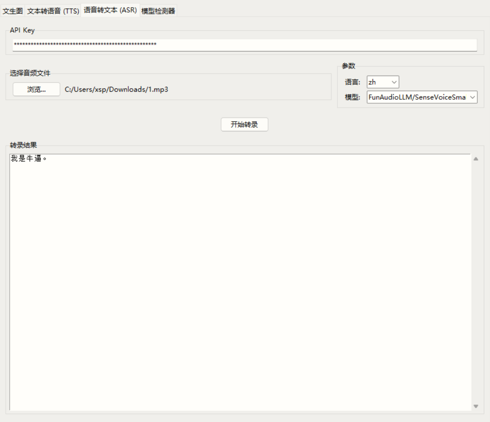

# SiliconFlow 工具套件 GUI

## 简介

本项目是一个使用 Python 和 Tkinter 构建的图形用户界面（GUI）应用程序，旨在方便用户与 SiliconFlow AI 平台的多种模型进行交互。它将多个常用的 AI 功能集成到一个统一的界面中，简化了 API 的调用过程。

目前集成的功能包括：

*   **文生图 (Text-to-Image):** 根据文本描述生成图像。
*   **文本转语音 (Text-to-Speech, TTS):** 将文本转换为自然语音。
*   **语音转文本 (Speech-to-Text, ASR):** 将音频文件转录为文本。
*   **模型检测器:** 检测当前 API Key 可用的模型，并可选择性地更新其他功能模块的模型列表。

## 功能概览

*   **统一界面:** 通过标签页在不同的 AI 功能之间轻松切换。
*   **API Key 管理:** 在每个功能模块或模型检测器中输入一次 API Key 即可使用。**注意：提供的默认 Key 仅为示例，无法直接使用，请务必替换为您自己的有效 Key。**
*   **参数调整:** 为每个功能提供了常用的参数设置选项（如模型选择、尺寸、步数、语速、语言等）。
*   **结果预览与保存:**
    *   文生图：直接在界面预览生成的图像，并可保存为文件。
    *   文本转语音：可直接播放生成的音频，并可保存为文件。
    *   语音转文本：在文本框中显示转录结果。
*   **模型动态更新:** 模型检测器可以获取最新的可用模型列表，并一键更新到文生图、TTS 和 ASR 功能的下拉菜单中。
*   **状态反馈:** 底部状态栏实时显示当前操作状态或结果信息。
*   **异步处理:** API 请求在后台线程中执行，避免界面卡顿。

## 技术栈

*   **语言:** Python 3
*   **GUI 库:** Tkinter (ttk)
*   **HTTP 请求:** Requests
*   **图像处理:** Pillow (PIL Fork)

## 安装

1.  **确保您已安装 Python 3。** 可以从 [Python 官网](https://www.python.org/) 下载并安装。
2.  **克隆或下载本项目代码。**
3.  **安装所需的依赖库:** 打开终端或命令提示符，进入项目所在的目录，然后运行以下命令：
    ```bash
    pip install requests Pillow tk
    ```
    *注意：Tkinter 通常是 Python 标准库的一部分，无需单独安装。如果遇到问题，请确保您的 Python 安装包含了 Tkinter 支持。*

## 运行

在终端或命令提示符中，确保您位于项目根目录下（即包含 `siliconflow_suite_gui.py` 文件的目录），然后执行以下命令：

```bash
python siliconflow_suite_gui.py
```

程序窗口将会启动。

## 使用说明

### 通用操作

1.  **API Key:** 程序启动时，API Key 输入框会预填一个**无效的示例 Key**。请**务必**将其替换为您自己的有效 SiliconFlow API Key。您可以在每个功能选项卡的顶部输入框中修改。**没有有效的 API Key，程序将无法工作。**
2.  **功能切换:** 点击窗口顶部的标签页（"文生图", "文本转语音 (TTS)", "语音转文本 (ASR)", "模型检测器"）来切换不同的功能界面。
3.  **状态栏:** 窗口底部的状态栏会显示程序当前的运行状态，例如“正在生成...”、“下载成功”、“检测完成”等。

### 文生图 (Text-to-Image)

1.  **输入 Prompt:** 在 "Prompt (描述图像)" 文本框中输入您想要生成的图像的描述。
2.  **输入 Negative Prompt (可选):** 在 "Negative Prompt (不希望出现)" 文本框中输入您不希望在图像中出现的元素。
3.  **选择参数:**
    *   **模型:** 从下拉列表中选择要使用的文生图模型。
    *   **尺寸:** 选择生成图像的分辨率。
    *   **步数 (Steps):** 调整生成过程的迭代步数。
    *   **引导系数 (CFG):** 控制生成结果与 Prompt 的相关性强度。
    *   **种子 (Seed):** 输入一个整数作为种子可以生成可复现的结果；留空则使用随机种子。
4.  **点击 "生成图像" 按钮。**
5.  等待生成完成，图像会显示在右侧的预览区域。
6.  生成成功后，"保存图像" 按钮会启用，点击它可以将图像保存到本地。



### 文本转语音 (TTS)

1.  **输入文本:** 在 "输入文本" 框中粘贴或输入需要转换为语音的文字。
2.  **选择参数:**
    *   **模型:** 选择要使用的 TTS 模型。
    *   **音色:** 根据所选模型，从下拉列表中选择喜欢的音色。
    *   **语速:** 调整生成语音的速度（1.0 为正常语速）。
    *   **增益:** 调整生成语音的音量（0.0 为默认音量）。
    *   **格式:** 选择输出音频文件的格式（如 mp3, wav 等）。
3.  **点击 "生成语音" 按钮。**
4.  等待生成完成。成功后，"播放" 和 "保存" 按钮会启用。
5.  **点击 "播放"** 可以试听生成的语音（依赖系统默认音频播放器）。
6.  **点击 "保存"** 可以将生成的语音保存为音频文件。



### 语音转文本 (ASR)

1.  **选择文件:** 点击 "浏览..." 按钮，选择您本地的音频文件（支持 wav, mp3, m4a, ogg, flac 等常见格式）。所选文件的路径会显示在按钮旁边。
2.  **选择参数:**
    *   **语言:** 选择音频文件中的主要语言（如 zh, en）。
    *   **模型:** 选择用于转录的 ASR 模型（目前主要是 `FunAudioLLM/SenseVoiceSmall`）。
3.  **点击 "开始转录" 按钮。**
4.  程序会上传文件并进行转录，请耐心等待。
5.  转录完成后，结果会显示在下方的 "转录结果" 文本框中。



### 模型检测器

1.  **确认 API Key:** 确保顶部的 API Key 输入框中是您有效的 Key。
2.  **点击 "检测可用模型" 按钮。**
3.  程序会调用 SiliconFlow API 获取模型列表，并尝试将其分类为“文生图”、“TTS”和“ASR”模型，分别显示在对应的文本框中。
4.  检测完成后，如果检测到了任何模型，“更新其他选项卡列表”按钮会被启用。
5.  **（可选）点击 "更新其他选项卡列表" 按钮:** 这会将检测到的模型 ID 更新到“文生图”、“文本转语音 (TTS)”和“语音转文本 (ASR)”选项卡的模型下拉列表中。
    *   **注意:** 此操作只会更新模型 ID 列表。对于 TTS 功能，新添加的模型的可用音色信息无法自动获取，需要参考 SiliconFlow 文档或自行测试后手动修改 `INITIAL_TTS_MODELS` 字典。

## 注意事项与已知问题

*   **API Key:** **极其重要！** 请务必使用您自己的有效 SiliconFlow API Key 替换掉程序中预设的示例 Key (`sk-leirgmdwwghisduaqjbuxbetxcnpdypnpxpnpycozszugwnh`)。**没有有效的 Key，程序无法连接 SiliconFlow 服务。**
*   **模型可用性:** 模型检测器依赖于 SiliconFlow `/v1/models` API 的返回结果，并且模型分类基于关键字匹配，可能不完全准确或包含非目标类型的模型。请以 SiliconFlow 官方文档为准。
*   **TTS 音色:** “更新其他选项卡列表”功能无法自动更新 TTS 模型的音色列表。如果通过检测器添加了新的 TTS 模型，您可能需要在代码中手动补充其支持的音色信息到 `INITIAL_TTS_MODELS` 字典。
*   **模型标识符:** 您在界面上看到的模型名称（尤其是一些带有 `Pro/` 或 `LoRA/` 前缀的）可能与 SiliconFlow API 实际接受的 `model` 参数值略有不同。如果遇到模型相关的错误，请检查并使用正确的模型 ID。
*   **网络请求:** 所有与 SiliconFlow API 的交互都需要网络连接，并可能产生相应的 API 调用费用。请注意您的使用量。
*   **错误处理:** 程序包含基本的错误处理，但可能无法覆盖所有异常情况。如果遇到问题，请查看终端输出的调试信息和错误消息。
*   **音频播放:** TTS 功能的“播放”按钮依赖于您操作系统正确配置了默认的音频播放器来打开临时文件。

## 未来可能的改进

*   更精确的模型分类逻辑。
*   自动获取或允许用户配置 TTS 模型的音色。
*   添加更多 API 参数的配置选项。
*   优化界面布局和用户体验。
*   增加对流式 API 的支持（如果需要）。
*   将配置（如 API Key, 模型列表）保存到外部文件。

---

希望这个 README 对您有所帮助！